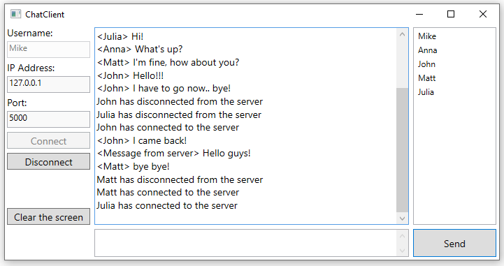

# chatClient
 
ChatClient is a simple TCP/IP based client application which is meant to communicate with the server app linked below. Made for personal learning purposes. There is not a private messaging possibility (yet) and every message is sent to all clients which are connected to the server. The server also informs when someone connects or disconnects. You can use the client app as you want. Please, have fun!

Included features:
 - opens a file named logfile.txt when the app is opened and saves when the app is closed. If the file does not exist, a new file is created.
 - changing username 
 - clearing the screen

C# WPF .NET Framework Application

The Server App:
https://github.com/miikkamq/chatServer

